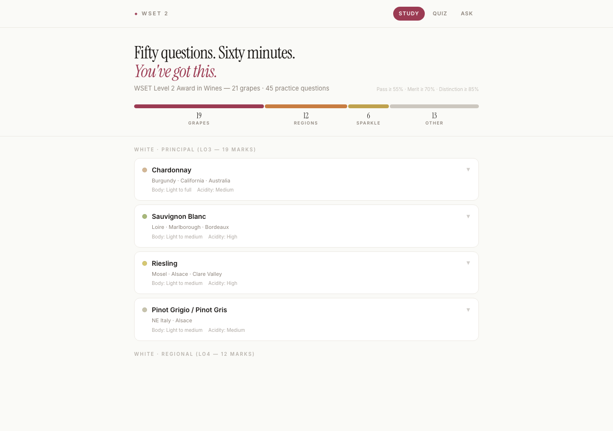
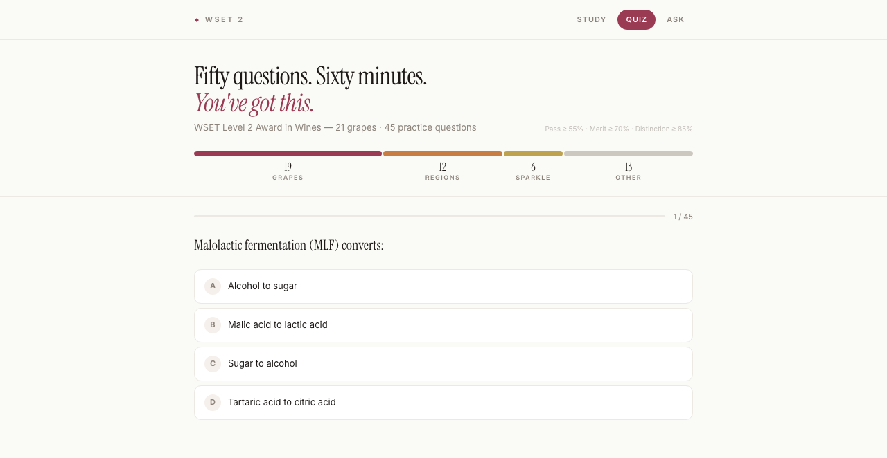
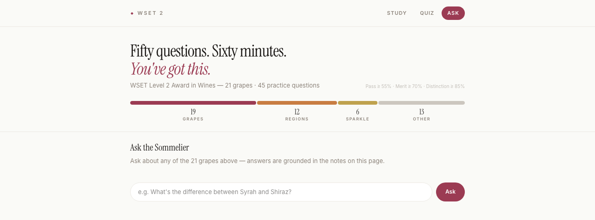
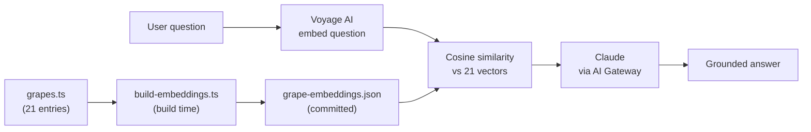

# WSET 2 Study Companion

[](https://wset-app-umber.vercel.app)
[](https://github.com/chrisamber/wset-2-study-companion/actions/workflows/ci.yml)
[](LICENSE)
[](https://nextjs.org)
[](https://react.dev)
[](https://tailwindcss.com)
[](#built-with-claude-code)

A study app for the WSET Level 2 Award in Wines exam — built for a real person studying for a real exam, then packaged up as a small case study in scoped, judgment-driven engineering.

**Live demo:** https://wset-app-umber.vercel.app



## What it does

- **Study** — flippable cards for 21 grape varieties, prioritized by exam weight: all 8 LO3 "principal" grapes, the highest-yield LO4 "regional" grapes, plus Muscat for LO5 sparkling/fortified (body, acidity, tannin, aromas, regions, food pairings). Not the full syllabus — see [Why it exists](#why-it-exists).
- **Quiz** — 45 scored multiple-choice questions covering grape-to-region associations and tasting logic, graded against the exam's real pass/merit/distinction thresholds.
- **Ask the Sommelier** — a free-form chat that answers wine questions grounded in the app's own grape data, using retrieval-augmented generation (RAG). Ask it something outside that data and it says so, instead of making something up. Questions are sent to Voyage AI and Claude (via the Vercel AI Gateway) to generate answers.

## Screenshots

**Quiz**


**Ask the Sommelier**


## Why it exists

Built for Zeal, an Assistant Manager studying for her WSET Level 2 exam, scoped around one fact from the syllabus: grape varieties and their regions make up 62% of the exam. The app deliberately covers that ground well rather than the whole syllabus shallowly.

## Technical build

**Stack:** Next.js 16 (App Router), React 19, Tailwind v4, Vercel AI SDK 7, Claude via the Vercel AI Gateway, Voyage AI embeddings.

**Ask the Sommelier — retrieval, sized to the corpus:**

The retrieval corpus is 21 grape entries — small enough that a hosted vector database would be pure overhead. Instead:



1. A one-off build script (`scripts/build-embeddings.ts`) embeds each grape's data with Voyage AI and writes the vectors to a committed static JSON file (`src/data/grape-embeddings.json`).
2. At request time, the API route (`src/app/api/chat/route.ts`) embeds the user's question, ranks it against those 21 vectors with plain cosine similarity (no library — it's about ten lines of math), and passes the top matches to Claude as grounding context.
3. Claude is instructed to answer only from that context, and to say so plainly when a question falls outside it.

No database, no hosting cost beyond the Next.js app itself. The interesting engineering decision here wasn't building retrieval — it was *not* reaching for a vector database, because a 21-item corpus doesn't justify one.

The chat model is called through the Vercel AI Gateway rather than a direct provider SDK — a plain `"anthropic/claude-sonnet-4-6"` string passed straight to `streamText`, with zero provider-specific code. Vercel's docs describe zero-config OIDC authentication for this in production; testing the live deployment directly showed that didn't hold in practice here, so `AI_GATEWAY_API_KEY` is set explicitly as a production environment variable too, the same as local dev — a reminder to verify a vendor's documented default against the actual deployed behavior rather than assume it.

**Deliberately out of scope:** broader retrieval across the full WSET syllabus (would require third-party spec material this repo doesn't include, for copyright reasons), user accounts, persistent chat history, and production-grade rate limiting (a light in-memory guard is proportionate at this traffic level).

## Built with Claude Code

This app — including the Ask the Sommelier feature, its retrieval design, and this write-up — was built working with Claude Code as an agentic development partner: a brainstorm to explore the design space, a written spec, an implementation plan with tests defined up front, then task-by-task implementation. Because AI SDK APIs move fast enough to drift out of a model's training data, the exact API reference for the installed SDK version is captured locally in `docs/ai-sdk-7-reference.md` and was read before writing any of the AI-facing code.

## Running locally

```bash
npm install
cp .env.example .env.local   # add your own VOYAGE_API_KEY and AI_GATEWAY_API_KEY
npm run build:embeddings     # generates src/data/grape-embeddings.json
npm run dev
```
