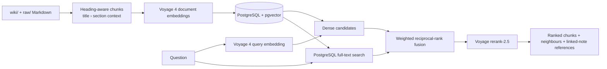

# Decant 🍷

An open-source WSET Level 2 wine study pack — Obsidian vault, web app, and semantic search.

<!-- badges -->
[](LICENSE)

> **Project status (16 July 2026):** Actively maintained through **18 July
> 2026**, when my WSET Level 2 exam concludes. The repository will remain public
> afterward as an open study and retrieval project.

## What's inside

| Directory | Description |
|-----------|-------------|
| [`wiki/`](wiki/) | Obsidian study notes — varieties, concepts, foundation, practice exams, reference docs. Start at [`index.md`](wiki/index.md). |
| [`web/`](web/) | Next.js 16 web app (Learn / Explore / Decode / Climate / Quiz). [Live demo](https://decant-wines.vercel.app). Has its own README. |
| [`embeddings/`](embeddings/) | Retrieval layer for RAG: contextual chunking, Voyage 4 embeddings, pgvector + PostgreSQL FTS, reciprocal-rank fusion, and Voyage reranking. |
| `raw/` | Source reference material (gitignored — copyrighted). |

## Retrieval architecture

Decant implements the **retrieval and evidence layer** of a RAG system. It
deliberately stops before answer generation: the CLI returns inspectable source
chunks and linked-note references that a person or an LLM can use as grounded context.



| Stage | Implementation | Reasoning |
|---|---|---|
| Corpus and chunking | [`chunking.py`](embeddings/chunking.py) scans only `wiki/` and optional `raw/`, splits on level-two headings, bounds long sections, and prefixes each chunk with its title/section breadcrumb. | Keeps chunks semantically coherent while preserving document context. |
| Embedding and indexing | [`ingest.py`](embeddings/ingest.py) uses Voyage 4's document input mode, batches requests, hashes source content, and skips unchanged pages. | Keeps document/query representations intentional and avoids unnecessary embedding cost. |
| Candidate retrieval | [`retrieval.py`](embeddings/retrieval.py) runs pgvector cosine search and PostgreSQL full-text search, then combines rank lists with weighted reciprocal-rank fusion. Optional query variants are down-weighted. | Dense search recovers semantic matches; lexical search protects exact wine terms; rank fusion avoids comparing incompatible raw scores. |
| Precision and evidence | Voyage `rerank-2.5` scores the fused candidates against the original question. [`query.py`](embeddings/query.py) can return neighbouring chunks, one-hop linked-note references, JSON, and retrieval diagnostics. | Improves final precision while keeping every result inspectable and attributable to a source chunk. |
| Operational safety | Database connections require TLS unless explicitly configured otherwise; SQL scopes are parameterised; destructive pruning is opt-in. | Retrieval quality work should not trade away credential or source-data safety. |

**Current boundary:** this repository does not yet include an answer-generation
step or a checked-in retrieval benchmark. It exposes the evidence needed for
grounded generation without presenting generated prose as a sourced answer.

## Quick start

### Browse the notes

Open [`wiki/`](wiki/) as a vault in [Obsidian](https://obsidian.md). Notes use wikilinks (`[[note-slug]]`) and resolve by filename.

### Run the web app

```sh
cd web
npm install
npm run dev
```

Opens at `http://localhost:3000`. See [`web/README.md`](web/README.md) for details.

## Semantic search setup

Hybrid vector + full-text search over the vault using Voyage AI embeddings, pgvector, and Voyage rerank.

**Requirements:** Python 3.11 (tested; `voyageai` needs <3.14), PostgreSQL with pgvector.

1. Create the Python environment:

```sh
python3.11 -m venv embeddings/.venv
embeddings/.venv/bin/pip install -r embeddings/requirements.txt
```

2. Create a local Postgres database called `wset2brain`, then apply the bundled
   pgvector schema (safe to run again):

```sh
createdb wset2brain
psql "postgresql://localhost/wset2brain?sslmode=disable" -f embeddings/schema.sql
```

3. Copy `embeddings/.env.example` to `embeddings/.env` and add your Voyage AI
   API key. The example URL explicitly disables TLS for local Postgres; remote
   connections require TLS unless their URL selects another `sslmode`.

4. Index the vault:

```sh
embeddings/.venv/bin/python embeddings/ingest.py
```

Use `--allow-prune` after intentionally renaming, moving, or deleting notes. Use
`--force` when changing embedding models or deliberately rebuilding every vector.

5. Query:

```sh
embeddings/.venv/bin/python embeddings/query.py "what climate suits Pinot Noir?"
```

## Disclaimer

This project is **not affiliated with, endorsed by, or connected to** the Wine & Spirit Education Trust (WSET). All study material is independently authored. WSET is a registered trademark of the Wine & Spirit Education Trust.

## License

[MIT](LICENSE) — Chris Amber

## Author

**Chris Amber** — [chrisamber.dev](https://chrisamber.dev)
