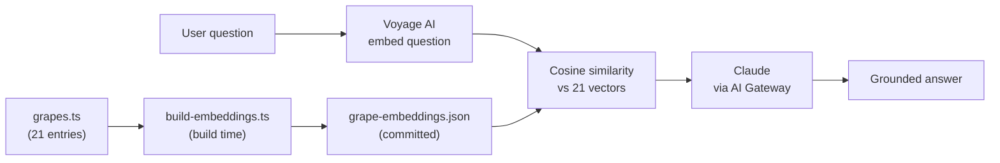

# v1.1 Portfolio Polish Implementation Plan

> **For agentic workers:** REQUIRED SUB-SKILL: Use superpowers:subagent-driven-development (recommended) or superpowers:executing-plans to implement this plan task-by-task. Steps use checkbox (`- [ ]`) syntax for tracking.

**Goal:** Ship the v1.1 portfolio-polish pass from `docs/superpowers/specs/2026-07-02-v1-1-portfolio-polish-design.md`: CI, a license, an architecture diagram, and complete tab screenshots — with zero changes to app behavior.

**Architecture:** Four independent, sequential changes to the `wset-app` repo — a CI workflow, a LICENSE file, a Mermaid diagram inserted into the README, and a screenshot-capture script plus its output images referenced from the README. No application code (`src/`) is touched.

**Tech Stack:** GitHub Actions, Node's built-in test runner (`node --test`), Mermaid (rendered natively by GitHub, no image generation), Chrome DevTools Protocol driven via Node's built-in `fetch`/`WebSocket` (no Playwright/Puppeteer dependency).

## Global Constraints

- Node's built-in test runner (`node --test`) only — no new test framework dependency.
- No new npm dependencies of any kind — screenshot capture uses only Node built-ins plus the system-installed Chrome.
- LICENSE: MIT, copyright holder "Chris Amber", year 2026.
- Architecture diagram must be Mermaid (renders natively on GitHub) — not a generated image file.
- No new app features, no content changes, no `package.json` version bump — this is a non-functional polish pass only.
- All commands below run from the `wset-app` project root (`/Users/chrisamber/Developer/wset-2/code/wset-app`), not the repo root.

---

### Task 1: CI pipeline

**Files:**
- Modify: `package.json`
- Create: `.github/workflows/ci.yml`
- Modify: `README.md` (badge row)

**Interfaces:** N/A — standalone config/content change, nothing here is consumed by later tasks.

- [ ] **Step 1: Add the `test` script to `package.json`**

The `.test.ts` files under `src/lib/` already use Node's built-in test runner (`node:test`/`node:assert`), but no `npm test` script exists yet to run them.

Edit `package.json`'s `scripts` block from:

```json
  "scripts": {
    "dev": "next dev",
    "build": "next build",
    "start": "next start",
    "lint": "eslint",
    "build:embeddings": "node --env-file-if-exists=.env.local scripts/build-embeddings.ts"
  },
```

to:

```json
  "scripts": {
    "dev": "next dev",
    "build": "next build",
    "start": "next start",
    "lint": "eslint",
    "test": "node --test src/lib/*.test.ts",
    "build:embeddings": "node --env-file-if-exists=.env.local scripts/build-embeddings.ts"
  },
```

- [ ] **Step 2: Run the new test script**

Run: `npm test`
Expected: all 9 existing tests pass — output ends with `# pass 9` and `# fail 0`.

- [ ] **Step 3: Create the CI workflow**

Create `.github/workflows/ci.yml`:

```yaml
name: CI

on:
  push:
    branches: [main]
  pull_request:
    branches: [main]

jobs:
  build-and-test:
    runs-on: ubuntu-latest
    steps:
      - uses: actions/checkout@v4
      - uses: actions/setup-node@v4
        with:
          node-version: 22
          cache: npm
      - run: npm ci
      - run: npm run lint
      - run: npm test
      - run: npm run build
```

- [ ] **Step 4: Run the same three commands locally as a dry run of the workflow**

Run: `npm run lint`
Expected: exits with no errors (exit code 0).

Run: `npm test`
Expected: `# pass 9`, `# fail 0` (same as Step 2).

Run: `npm run build`
Expected: ends with `✓ Compiled successfully` and a route summary table — no errors.

(GitHub Actions itself only runs once this is pushed — pushing is a separate decision outside this plan. This local run is the closest available proxy for "does the workflow pass.")

- [ ] **Step 5: Add a CI badge to the README**

Edit `README.md`:

Old:
```
[](https://wset-app-umber.vercel.app)
[](https://nextjs.org)
```

New:
```
[](https://wset-app-umber.vercel.app)
[](https://github.com/chrisamber/wset-2-study-companion/actions/workflows/ci.yml)
[](https://nextjs.org)
```

- [ ] **Step 6: Commit**

```bash
git add package.json .github/workflows/ci.yml README.md
git commit -m "Add CI workflow (lint, test, build) and test script"
```

---

### Task 2: MIT License

**Files:**
- Create: `LICENSE`
- Modify: `README.md` (badge row)

**Interfaces:** N/A — standalone content addition.

- [ ] **Step 1: Create the LICENSE file**

Create `LICENSE`:

```
MIT License

Copyright (c) 2026 Chris Amber

Permission is hereby granted, free of charge, to any person obtaining a copy
of this software and associated documentation files (the "Software"), to deal
in the Software without restriction, including without limitation the rights
to use, copy, modify, merge, publish, distribute, sublicense, and/or sell
copies of the Software, and to permit persons to whom the Software is
furnished to do so, subject to the following conditions:

The above copyright notice and this permission notice shall be included in all
copies or substantial portions of the Software.

THE SOFTWARE IS PROVIDED "AS IS", WITHOUT WARRANTY OF ANY KIND, EXPRESS OR
IMPLIED, INCLUDING BUT NOT LIMITED TO THE WARRANTIES OF MERCHANTABILITY,
FITNESS FOR A PARTICULAR PURPOSE AND NONINFRINGEMENT. IN NO EVENT SHALL THE
AUTHORS OR COPYRIGHT HOLDERS BE LIABLE FOR ANY CLAIM, DAMAGES OR OTHER
LIABILITY, WHETHER IN AN ACTION OF CONTRACT, TORT OR OTHERWISE, ARISING FROM,
OUT OF OR IN CONNECTION WITH THE SOFTWARE OR THE USE OR OTHER DEALINGS IN THE
SOFTWARE.
```

- [ ] **Step 2: Verify the file**

Run: `head -3 LICENSE`
Expected:
```
MIT License

Copyright (c) 2026 Chris Amber
```

- [ ] **Step 3: Add a License badge to the README**

This step assumes Task 1 has already landed (the CI badge is present). Edit `README.md`:

Old:
```
[](https://github.com/chrisamber/wset-2-study-companion/actions/workflows/ci.yml)
[](https://nextjs.org)
```

New:
```
[](https://github.com/chrisamber/wset-2-study-companion/actions/workflows/ci.yml)
[](LICENSE)
[](https://nextjs.org)
```

If Task 1 hasn't landed yet (no CI badge present), instead insert the License badge directly after the Live-demo badge line.

- [ ] **Step 4: Commit**

```bash
git add LICENSE README.md
git commit -m "Add MIT LICENSE"
```

---

### Task 3: Architecture diagram

**Files:**
- Modify: `README.md` (Technical build section)

**Interfaces:** N/A — standalone content addition.

- [ ] **Step 1: Insert a Mermaid flowchart into the retrieval section**

Edit `README.md`. The block below is wrapped in a single 4-backtick fence (since its "New" side contains its own ` ```mermaid ` fence) — everything between the opening and closing 4-backtick lines is literal text to write into the file, including the two 3-backtick lines around the mermaid diagram.

````
Old:
The retrieval corpus is 21 grape entries — small enough that a hosted vector database would be pure overhead. Instead:

1. A one-off build script (`scripts/build-embeddings.ts`) embeds each grape's data with Voyage AI and writes the vectors to a committed static JSON file (`src/data/grape-embeddings.json`).

New:
The retrieval corpus is 21 grape entries — small enough that a hosted vector database would be pure overhead. Instead:



1. A one-off build script (`scripts/build-embeddings.ts`) embeds each grape's data with Voyage AI and writes the vectors to a committed static JSON file (`src/data/grape-embeddings.json`).
````

- [ ] **Step 2: Verify by rendering**

There's no local Mermaid renderer in this repo, and adding one (e.g. `mermaid-cli`, which pulls in a headless-browser dependency) isn't justified for a single diagram. Verify instead by checking the diagram's file preview on GitHub after this commit is pushed — GitHub renders `mermaid` code fences natively. Confirm: all 8 nodes appear, and the two flows (build-time embedding, request-time retrieval) visually converge at the cosine-similarity node.

- [ ] **Step 3: Commit**

```bash
git add README.md
git commit -m "Add retrieval architecture diagram to README"
```

---

### Task 4: Tab screenshots

**Files:**
- Create: `scripts/capture-screenshot.mjs`
- Create/overwrite: `public/screenshots/study.png`, `public/screenshots/quiz.png`, `public/screenshots/ask.png`
- Modify: `README.md` (new Screenshots section)

**Interfaces:** N/A — standalone dev script plus static assets. `capture-screenshot.mjs` is a CLI utility, not imported by app code.

- [ ] **Step 1: Create the capture script**

Create `scripts/capture-screenshot.mjs`:

```js
#!/usr/bin/env node
// Captures a screenshot of one tab of the running app via the Chrome
// DevTools Protocol — no browser-automation dependency, just Node's built-in
// fetch/WebSocket driving a headless Chrome the script launches itself.
//
// Usage: node scripts/capture-screenshot.mjs <url> <tabButtonText|""> <outPath>
// Example: node scripts/capture-screenshot.mjs http://localhost:4123 quiz public/screenshots/quiz.png
// Pass "" for tabButtonText to screenshot the default (Study) tab.
//
// Requires Google Chrome installed at the default macOS path below, and the
// app already served at <url> (e.g. `npm run build && npx next start -p 4123`).

const [, , url, buttonText, outPath] = process.argv;
if (!url || outPath === undefined) {
  console.error('Usage: node scripts/capture-screenshot.mjs <url> <tabButtonText|""> <outPath>');
  process.exit(1);
}

const CHROME = "/Applications/Google Chrome.app/Contents/MacOS/Google Chrome";
const DEBUG_PORT = 9333;

const { spawn } = await import("node:child_process");
const fs = await import("node:fs/promises");

const chrome = spawn(CHROME, [
  "--headless=new",
  "--disable-gpu",
  `--remote-debugging-port=${DEBUG_PORT}`,
  "--window-size=1280,832",
  "--hide-scrollbars",
  "about:blank",
]);

async function waitForDebugger() {
  for (let i = 0; i < 50; i++) {
    try {
      const res = await fetch(`http://localhost:${DEBUG_PORT}/json/version`);
      if (res.ok) return;
    } catch {}
    await new Promise((r) => setTimeout(r, 200));
  }
  throw new Error("Chrome debugger never came up");
}

function send(ws, method, params = {}) {
  return new Promise((resolve, reject) => {
    const id = Math.floor(Math.random() * 1e9);
    const onMessage = (event) => {
      const msg = JSON.parse(event.data);
      if (msg.id === id) {
        ws.removeEventListener("message", onMessage);
        if (msg.error) reject(new Error(JSON.stringify(msg.error)));
        else resolve(msg.result);
      }
    };
    ws.addEventListener("message", onMessage);
    ws.send(JSON.stringify({ id, method, params }));
  });
}

try {
  await waitForDebugger();

  const putRes = await fetch(
    `http://localhost:${DEBUG_PORT}/json/new?${new URLSearchParams({ url })}`,
    { method: "PUT" }
  );
  const target = await putRes.json();

  const ws = new WebSocket(target.webSocketDebuggerUrl);
  await new Promise((resolve, reject) => {
    ws.addEventListener("open", resolve);
    ws.addEventListener("error", reject);
  });

  await send(ws, "Page.enable");
  await send(ws, "Runtime.enable");

  const loadFired = new Promise((resolve) => {
    const onMessage = (event) => {
      const msg = JSON.parse(event.data);
      if (msg.method === "Page.loadEventFired") {
        ws.removeEventListener("message", onMessage);
        resolve();
      }
    };
    ws.addEventListener("message", onMessage);
  });
  await send(ws, "Page.navigate", { url });
  await loadFired;

  if (buttonText) {
    const clickExpr = `
      (function() {
        const btn = Array.from(document.querySelectorAll("button"))
          .find(b => b.textContent.trim().toLowerCase() === ${JSON.stringify(buttonText)});
        if (!btn) return "not-found";
        btn.click();
        return "clicked";
      })()
    `;

    let clickResult = "not-found";
    for (let i = 0; i < 25; i++) {
      const evalRes = await send(ws, "Runtime.evaluate", { expression: clickExpr });
      clickResult = evalRes.result.value;
      if (clickResult === "clicked") break;
      await new Promise((r) => setTimeout(r, 200));
    }
    if (clickResult !== "clicked") {
      throw new Error("Button never appeared: " + buttonText);
    }
  }

  // Give React a moment to re-render after the click.
  await new Promise((r) => setTimeout(r, 300));

  // The app's root div uses min-h-screen (and the panel wrapper uses
  // flex-1), so both stretch to fill the viewport regardless of content.
  // The last ".max-w-3xl" block (the tab panel itself) isn't stretched, so
  // its bottom reflects actual rendered content height.
  const heightRes = await send(ws, "Runtime.evaluate", {
    expression: `(() => {
      const blocks = document.querySelectorAll(".max-w-3xl");
      const last = blocks[blocks.length - 1];
      return Math.min(900, 20 + last.getBoundingClientRect().bottom);
    })()`,
  });
  const height = heightRes.result.value;

  const { data } = await send(ws, "Page.captureScreenshot", {
    format: "png",
    clip: { x: 0, y: 0, width: 1280, height, scale: 1 },
  });
  await fs.writeFile(outPath, Buffer.from(data, "base64"));
  console.log("wrote", outPath);

  ws.close();
} finally {
  chrome.kill();
}
```

- [ ] **Step 2: Build and serve the production app**

Run: `npm run build`
Expected: ends with `✓ Compiled successfully` and a route summary table.

Run: `(npx next start -p 4123 > /tmp/wset-prod-screenshot.log 2>&1 &)`
Then run: `sleep 3 && curl -s -o /dev/null -w "%{http_code}\n" http://localhost:4123`
Expected: `200`

(Using a production server, not `next dev`, avoids the Next.js dev-mode indicator badge appearing in the screenshots — it would otherwise show as a floating circular icon over the app content.)

- [ ] **Step 3: Capture all three tab screenshots**

Run:
```bash
node scripts/capture-screenshot.mjs http://localhost:4123 "" public/screenshots/study.png
node scripts/capture-screenshot.mjs http://localhost:4123 quiz public/screenshots/quiz.png
node scripts/capture-screenshot.mjs http://localhost:4123 ask public/screenshots/ask.png
```
Expected: each prints `wrote public/screenshots/<name>.png`.

- [ ] **Step 4: Stop the production server**

Run: `lsof -ti:4123 | xargs -r kill`

- [ ] **Step 5: Verify the images**

Run: `ls -la public/screenshots/`
Expected: `study.png`, `quiz.png`, `ask.png` all present, each larger than 0 bytes (in practice, tens of KB).

- [ ] **Step 6: Add a Screenshots section to the README**

Edit `README.md`:

Old:
```
- **Ask the Sommelier** — a free-form chat that answers wine questions grounded in the app's own grape data, using retrieval-augmented generation (RAG). Ask it something outside that data and it says so, instead of making something up.

## Why it exists
```

New:
```
- **Ask the Sommelier** — a free-form chat that answers wine questions grounded in the app's own grape data, using retrieval-augmented generation (RAG). Ask it something outside that data and it says so, instead of making something up.

## Screenshots

**Quiz**


**Ask the Sommelier**


## Why it exists
```

(The existing Study screenshot stays exactly where it is, as the top hero image — only its underlying file is refreshed in Step 3, not its position in the README.)

- [ ] **Step 7: Commit**

```bash
git add scripts/capture-screenshot.mjs public/screenshots/ README.md
git commit -m "Add Quiz/Ask screenshots and capture script; refresh Study screenshot"
```
